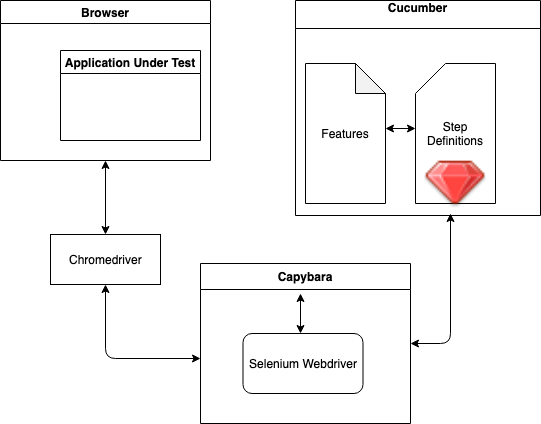

# Skeleton Acceptance Tests

This repository is a Skeleton to run Cucumber acceptance tests (with [Ruby][1] and [Selenium][2]), as part of the Land Registry [common-dev-env][3].
This skeleton includes sample tests to verify the basic behaviour of the skeleton, but these are not intended as standards to follow.
Any approaches built with this skeleton should fulfil your specific needs.

## Notes

* The gems used for the acceptance tests are contained within the `Gemfile`
* The `Gemfile.lock` provided contains working gem dependencies.
* [Ruby Style Guide][4] will provide examples and explanations for linting violations
* The [docker-base-image v4.1][5] is used to build this skeleton and currently uses:
    * Ruby version: 2.6.5
    * Rubygems version: 3.0.6
    * Bundler version: 2.0.2
* `support/config.rb` has the skeleton default values and driver configuration

## Architecture
The skeleton is composed of a few different technologies.

The key technologies used are:

* [Cucumber][8]
* [Ruby][1]
* [Selenium webdriver][2]
* [Capybara][6]
* [Chromedriver][7]





*High level acceptance test architecture diagram*

### Description

Cucumber feature files (business facing) are written in the english like Gherkin syntax.
These link to the step definitions (technical facing), written in Ruby.


When executed, the Ruby code triggers Capybara actions to interact with the page.
Capybara acts as a wrapper around Selenium (which really triggers the page interactions).
Capybara uses acceptance test type language, and is driver agnostic, so you could choose a different webdriver.

    # Cabybara example
    fill_in('some_field', with: 'some_text')

    # Selenium example
    driver.findElement(By.id('some_field').sendKeys('some_text'))


Selenium talks to Chromedriver which allows automation of a Chrome browser session.
The actions are performed against the web application under test.

The tests are run using headless chrome (you cannot see the browser open, and the tests running)


## Adding the skeleton to an existing dev-env
If you are already familiar with the [common-dev-env][3] and have an existing dev-env-config 
you can add the skeleton into your`configuration.yml`.

```yaml
  skeleton-acceptance-tests:
    repo: git@github.com:LandRegistry/skeleton-acceptance-tests.git
    branch: master
```

## Quick Start
If you have no existing dev-env-config, you can use the example [acctest-dev-env-config][9], when creating a new dev-env.
Assuming this is the first time launching the machine you will be prompted for the url of a configuration repository 
(both SSH or HTTP(S) Git formats will work).

Paste in the [acctest-dev-env-config][9] Git link and press enter.
This will create a running dev-env with a working test configuration.

## To Run the tests
* Firstly confirm commands listed below correspond to whats provided in the
[Common dev-env][3].
But defer to the dev-env documentation as the source of truth, in the event of conflicting information.


```shell
# Use common-dev-env alias to execute run_tests.sh within the docker container
acctest skeleton-acceptance-tests
```

```shell
# or use the full command without the common-dev-env alias
docker-compose run --rm skeleton-acceptance-tests sh run_tests.sh
```

 ```shell
# To run only tests with specific tags:
acctest skeleton-acceptance-tests --tags "@run_me"
```
 ```shell
# To exclude tests based on tags use "not"
acctest skeleton-acceptance-tests --tags "not @dont_run_me"
```

```shell
# This can be comibined to run some tags, while excluding others
acctest skeleton-acceptance-tests --tags "@included_tag and not @excluded_tag"
```

## Rubocop
* The configuration of Rubocop and any future configuration can be done in:
  `.rubocop.yml`. Check the `TargetRubyVersion` matches what is running in your environment  
  
* A Rubocop evaluation of the Ruby code must be done during development, with violations resolved
  
* A standalone run of Rubocop can be done with the following commands:

```shell
# Use common-dev-env alias to execute run_linting.sh within the docker container
acclint skeleton-acceptance-tests
```
which is equivalent to

```shell
docker-compose run --rm skeleton-acceptance-tests sh run_linting.sh
```

Rubocop can attempt to automatically fix any linting issues in your code using the flag `-a`.
```shell
docker-compose run --rm skeleton-acceptance-tests rubocop -a
```
Use this with caution. It can break your code.

It's better to use this at file or folder level, rather than suite level.
Rubocop can be used to lint a single file, rather than the whole codebase

```shell
docker-compose run --rm skeleton-acceptance-tests rubocop -a {path to your code}
```

## Automated Accessibility Checks (Axe)

Some automated accessibility checks, can be performed using the axe-matchers gem.
These checks will ***not prove a page is accessible***. Manual checks must still be performed.

Do not add axe checks as part of other tests. Tests should be atomic.
Axe tests should be separate from other acceptance tests. 
Examples can be found in `features/features/axe_accessibility.feature`

To check a page do the following:

1. Tag the scenario with `@axe`
This scenario should only navigate to the page you want to test, and get it into the correct state.

2. Once on the page use this step to run axe
` Then the page should be accessible according to: wcag2aa`

3. Run all tests tagged with `@axe`
You can use any the standard dev-env methods to do this.

e.g. `acctest skeleton-acceptance-tests --tags @axe`


## Universal dev-env support

Provided via configuration.yml, Dockerfile and fragments/docker-compose-fragment.yml.
configuration.yml lists the commodities the dev env needs to spin. NGINX may be used for the applications
The docker-compose-fragment.yml contains the service definition. The names will need modifying.
The Dockerfile simply sets the APP_NAME environment variable and installs the dependencies. Any specific variables or commands can be added here.

## support/env.rb file

This file contains the global variables that are obtained from the environment variables specified in the Dockerfile or exported from Jenkins

## support/config.rb

This details the configuration of ruby. Any libraries used must be required here. If function libraries are added to the lib-rb folder then the relative path must be added here

[1]: https://www.ruby-lang.org/en
[2]: https://www.seleniumhq.org/projects/webdriver/
[3]: https://github.com/LandRegistry/common-dev-env
[4]: https://github.com/rubocop-hq/ruby-style-guide
[5]: https://github.com/LandRegistry/docker-base-images/blob/master/dev_base_ruby/4.1/Dockerfile
[6]: https://github.com/teamcapybara/capybara
[7]: http://chromedriver.chromium.org/
[8]: https://cucumber.io/docs
[9]: https://github.com/aaronFlynn/acctest-dev-env-config

